# Tutorial: Audio Recording

This tutorial describes how to record audio using Adobe Audition software at the iMac Station.

## Materials Needed
<div class="grid cards" markdown>

- **Your Library Card**
- **iMac Station**
- **Sony Headphones**
- **Blue Yeti Microphone**
</div>

## Prerequisites
- [Tutorial: iMac Login](tutorial-iMac-login.md)

## Hardware Setup

There are two ways to set up the audio recording hardware:

- **With Mic Monitoring:** You will be able to hear what the microphone is picking up in real-time through your headphones. The headphones in this hardware setup will be plugged into the bottom of the microphone.
- **Without Mic Monitoring:** You won't be able to hear what the microphone is picking up while you're recording, but the recording software will still pick it up and you will be able to listen to it after you are finished recording. The headphones in this hardware setup will be plugged into the left side of the iMac directly.

Please choose the appropriate monitoring setup for your project and follow the hardware setup diagram accordingly.

!!! note

    The arrowheads represent a plug being plugged into a receptacle.

=== "Without Mic Monitoring"

    ```mermaid
    graph LR
      accTitle: Hardware Diagram for "Without Mic Monitoring" Scenario
      accDescr {
        "Keyboard" plugged into "USB Hub".
        "Mouse" plugged into "USB Hub".
        "Blue Yeti Microphone" plugged into "USB Hub".
        "USB Hub" plugged into "iMac".
        "Sony Headphones" plugged into "iMac".
      }
      Keyboard --> Hub[USB Hub]
      Mouse --> Hub[USB Hub]
      Mic[Blue Yeti Microphone] --> Hub[USB Hub]
      Hub[USB Hub] --> iMac
      Headphones[Sony Headphones] --> iMac
    ```

=== "With Mic Monitoring"

    ```mermaid
    graph LR
      accTitle: Hardware Diagram for "With Mic Monitoring" Scenario
      accDescr {
        "Keyboard" plugged into "USB Hub".
        "Mouse" plugged into "USB Hub".
        "Blue Yeti Microphone" plugged into "USB Hub".
        "USB Hub" plugged into "iMac".
        "Sony Headphones" plugged into "Blue Yeti Microphone".
      }
      Keyboard --> Hub[USB Hub]
      Mouse --> Hub[USB Hub]
      Mic[Blue Yeti Microphone] --> Hub[USB Hub]
      Hub[USB Hub] --> iMac
      Headphones[Sony Headphones] --> Mic[Blue Yeti Microphone]
    ```

## Microphone Setup

Once the hardware has been set up, ensure the red light labeled **:fontawesome-solid-microphone: Mute** is solidly red and not blinking. If it is blinking, press the button so that it remains solid. If you don't see a red light, then perhaps it wasn't plugged in correctly to begin with.

Please note these knobs:

- **:fontawesome-solid-headphones: Volume** on the front: This control is only relevant if set up with mic monitoring. It increases and decreases the volume of the headphones.
- **Gain** on the back: This control amplifies the mic input volume. If the recording is too quiet or too loud, try adjusting this knob. It is best practice to keep gain knob as low as possible and turn the mic input volume to 100% as described in [iMac System Settings section](#imac-system-settings).
- **Pattern** on the back: This control changes the microphone's configuration according to the *Patterns Chart* in the next section. You may go ahead and configure this to your liking now.

### Patterns Chart
| Pattern                  | Symbol                                                                        | Description                                                                                                                                                                                                                       |
| ------------------------ | ----------------------------------------------------------------------------- |---------------------------------------------------------------------------------------------------------------------------------------------------------------------------------------------------------------------------------- |
| **Stereo Mode**          |                     | Uses both the left and right channels to capture a wide, realistic sound image. It is perfect for recording acoustic guitar or choir.                                                                                             |
| **Omnidirectional Mode** |   | Picks up sound equally from all around the mic. It's best used in situations when you want to capture the ambience of "being there" — like a live recording of a band's performance, a multi-person podcast or a conference call. |
| **Cardioid Mode**        |                 | Well-suited to podcasts, vocal performances, voice-overs and instruments. Cardioid mode records sound sources that are directly in front of the microphone, delivering rich, full-bodied sound.                                   |
| **Bidirectional Mode**   |       | Records from both the front and the rear of the microphone — ideal for recording a duet or a two-person interview.                                                                                                                |

## iMac System Settings

### 1. Launch System Settings

Launch the System Settings app from the Dock on the iMac desktop by clicking the settings icon:

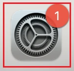

### 2. Navigate to Sound Settings

1. In the System Settings search box, type `sound`.
2. Click on the top search result with the red sound icon, labeled "Sound".

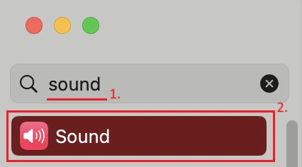

### 3. Set the System Output Device

The output device setting allows for apps to automatically choose the correct device to play audio on.

!!! note

    Some apps at times require you to explicitly set the output device in their respective application settings. Some apps may require you to restart them when system sound configuration has changed.

1. Find the **Output & Input** section in the Sound Settings.
2. Ensure you are on the "Output" tab.
3. Recall from the [Hardware Setup](#hardware-setup) section that we configured our hardware *with mic monitoring* or *without mic monitoring*. Depending on your configuration:
    - **With Mic Monitoring:** Select the device with the name: *Yeti Stereo Microphone*
    - **Without Mic Monitoring:** Select the device with the name: *External Headphones*

=== "Without Mic Monitoring"

    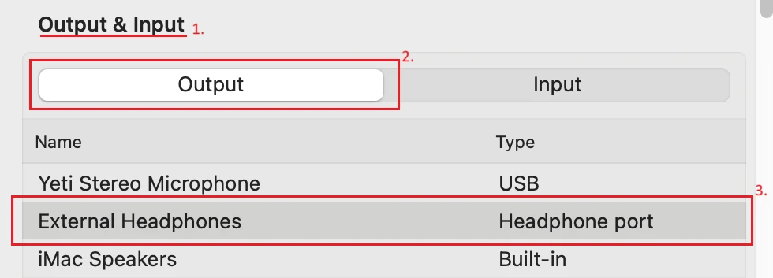

=== "With Mic Monitoring"

    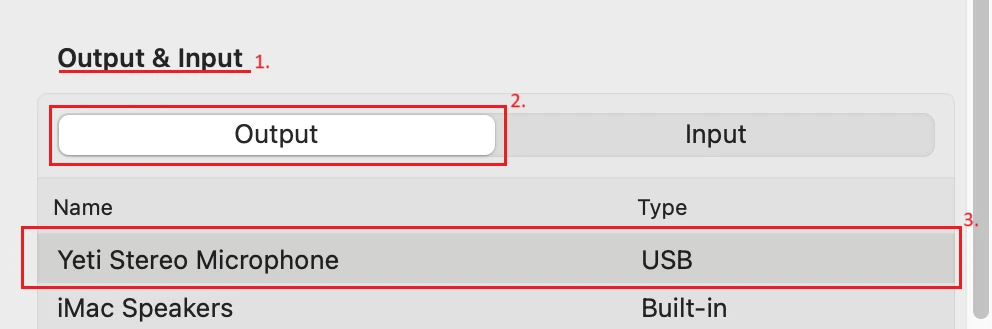

### 4. Set the Output Volume

!!! danger

    You can damage your hearing with loud headphone volumes, especially when listening for prolonged periods of time. Ensure that the volume is appropriate for your audio and if it is too loud, turn it down.

Staying in the **Output & Input** section of the Sound Settings from the previous step on the output tab, scroll down to the bottom below the output devices list and set the *Output volume* to your desired amount. Ensure that the Mute checkbox is left unchecked.

!!! tip

    If you are using mic monitoring, try setting the Output volume to 100% maximum and using the **:fontawesome-solid-headphones: Volume** knob on the front of the Blue Yeti Microphone to make the sound quieter.

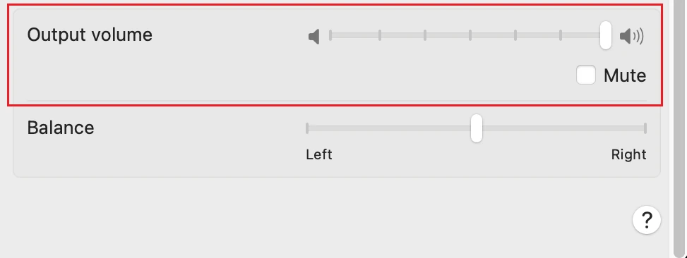

### 5. Set the System Input Device

The input device setting allows for apps to automatically choose the correct device for audio recording.

!!! note

    Some apps at times require you to explicitly set the input device in their respective application settings. Some apps may require you to restart them when system sound configuration has changed.

1. Once again, find the **Output & Input** section in the Sound Settings.
2. Switch to the "Input" tab.
3. Select the device with the name: *Yeti Stereo Microphone*

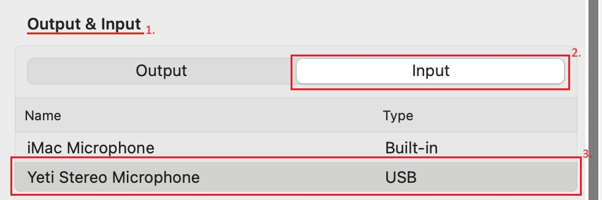

### 6. Set the Input Volume

For audio recording, it's best-practice to rely on hardware interfaces rather than software interfaces whenever possible. Therefore, we recommend adjusting the **Gain** knob on the back of the microphone instead of adjusting the System Settings input volume, keeping the System Settings input volume at 100% maximum at all times.

Staying in the **Output & Input** section of the Sound Settings from the previous step on the input tab, set the *Input volume* to 100%.

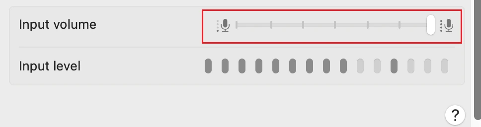

This is a great opportunity to check your input levels. Speak loudly into the microphone as if you were recording, and keep an eye on the dark grey bars labeled "Input level". You want the levels to be as high as possible, but even more importantly you don't want it to be too high, or your audio will run the risk of clipping. If your audio clips, you will lose bits of audio information during your recording and the issue will be quite noticeable *and not in a good way*!

Play with the **Gain** knob on the back of the microphone to make the input quieter if needed to avoid clipping. For reference, a gain with the knob tick-mark pointed upwards and slightly to the left worked well for our test.


You may want to double check your levels with a test recording before you make your real recording, just to be sure you got the levels right.

## Recording with Adobe Audition

### 1. Launch Adobe Audition

Launch the Adobe Audition app from the Dock on the iMac desktop by clicking the "Au" icon:


### 2. Record

Point the microphone to the ceiling, the front with the mute button facing towards you. Allow for space, do not talk directly into the microphone.

Click the red circle record button in the Editor panel.

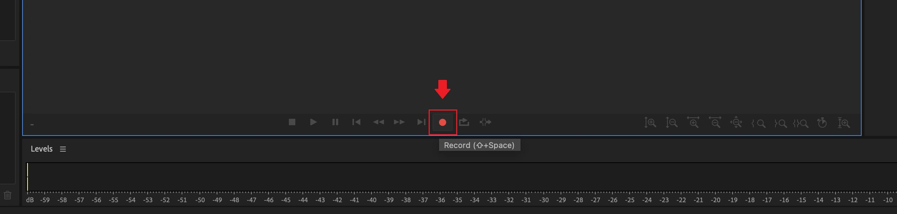

Then, in the New Audio File dialog that pops up:

1. Create a name that describes your audio.
2. Click OK to begin recording.

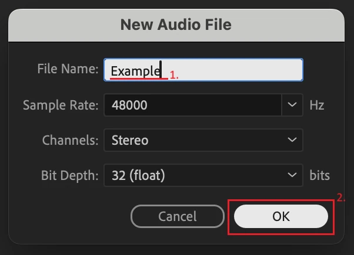

Click the square stop button in the Editor panel when finished recording.

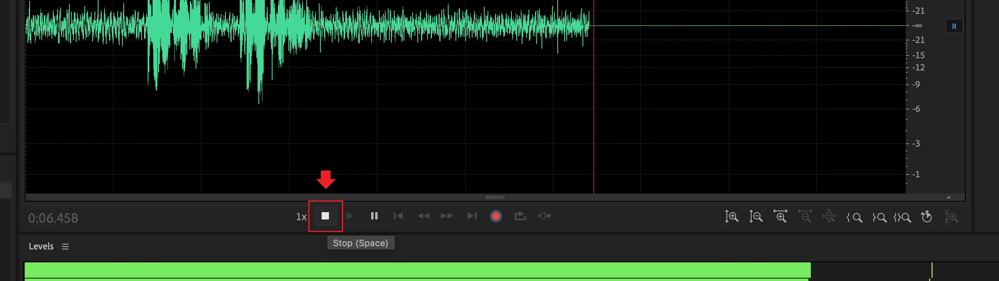

### 3. Export Audio

Go to File → Save As...

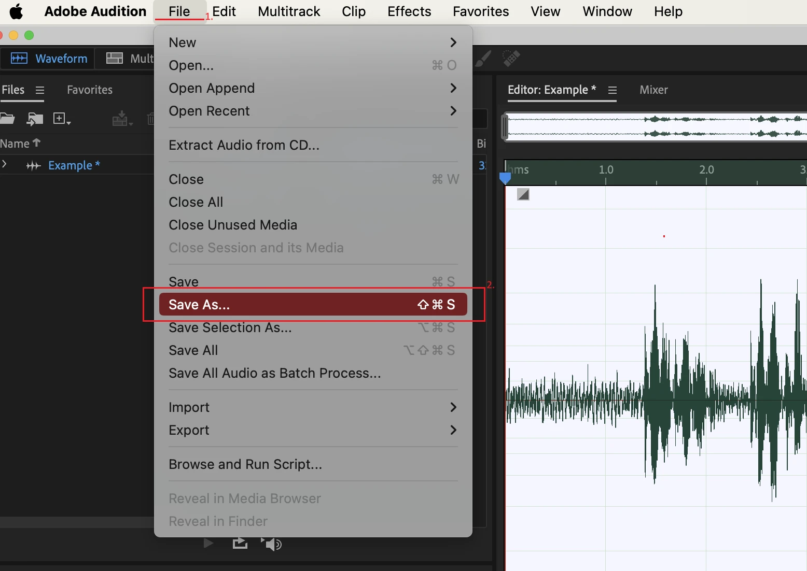

In the Save As dialog that pops up, do the following:

1. Create a fitting File name for your file.
2. When you are satisfied with all of your settings, making special note of the Location and Format, click OK.

!!! info

    Wave PCM files are a lossless high quality format. Because of this, they are also large in file size making it more difficult to store and transfer. If you would like a smaller file size and you are willing to compromise on sound quality, then you should choose a .mp3 file format instead.

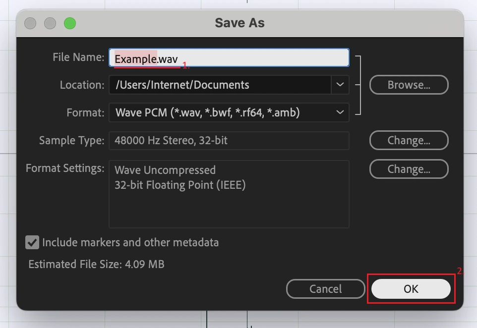

To get the file off of the iMac to wherever you need it, check out one of the tutorials listed in [Next Steps](#next-steps).

## Next Steps

- [File Transfer Tutorial: Dropbox](/Tutorials/File-Transfer/tutorial-dropbox/)
- [File Transfer Tutorial: Flash Drive](/Tutorials/File-Transfer/tutorial-flash-drive/)
- [File Transfer Tutorial: Google Drive](/Tutorials/File-Transfer/tutorial-google-drive/)
