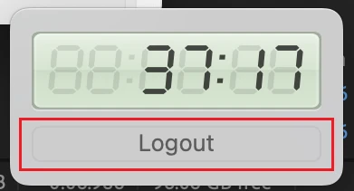

# Tutorial: iMac Login

## Materials Needed

- **Your Library Card**
- **iMac Station**

## Step 1: Ensure iMac is On

If the screen is not lit and nothing happens when you jiggle the mouse or press a key on the keyboard, the iMac is off.

Press the power button in the back on the left-hand side.

## Step 2: Login

Login using the numbers on the back of your library card.

@TODO: Get screenshot of login screen

!!! note

    If the login screen doesn't look like the picture, try rebooting the iMac using the power button.

## When Session is Finished

When you are done with the computer, please click the logout button next to the session timer as pictured here. Return other materials to the way you found them.

